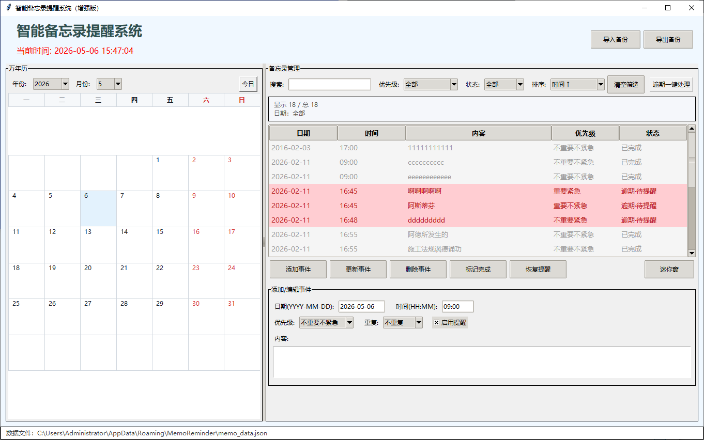

# MemoCalendarReminder

一个基于 Python Tkinter 开发的本地桌面万年历备忘录工具，集成日期筛选、到点提醒、搜索排序、逾期处理、迷你悬浮待办窗口和 JSON 备份恢复功能。

它适合个人日常待办、项目跟进、临时提醒和本地离线备忘场景。所有数据默认保存在本机，不依赖服务器、不依赖浏览器，也不需要联网。

## 功能特点

### 万年历视图

- 左侧月历视图，支持按年份和月份切换
- 单击日期：筛选该日期的备忘事项
- 双击日期：快速新增该日期的事项
- “今日”按钮：跳转到今天并恢复显示全部事项
- 日历日期格内显示事项数量提示：
  - 1～3 条事项显示小圆点
  - 4 条及以上显示数字徽标
  - 10 条及以上显示 `9+`

### 备忘录管理

- 添加、编辑、删除备忘事项
- 支持多选批量操作
- 支持标记完成、恢复提醒
- 支持四象限优先级：
  - 不重要不紧急
  - 不重要紧急
  - 重要不紧急
  - 重要紧急
- 支持事项状态显示：
  - 待提醒
  - 已提醒
  - 已完成
  - 逾期

### 搜索、筛选与排序

- 关键词搜索
- 按日期筛选
- 按优先级筛选
- 按状态筛选
- 支持排序方式：
  - 时间升序
  - 时间降序
  - 优先级高到低
  - 优先级低到高
  - 状态排序
  - 逾期优先

### 到点提醒

- 到达设定日期和时间后弹窗提醒
- 提醒窗口置顶显示
- 支持提示音提醒（Windows 环境）
- 提醒后事项自动变为“已提醒”，避免重复弹窗
- 弹窗中显示事项日期、时间、内容和优先级色条

### 逾期处理

- 未完成且时间已过的事项会显示为逾期
- 逾期事项高亮显示
- 支持当前筛选范围内批量完成逾期事项
- 支持当前筛选范围内批量恢复逾期提醒
- 恢复逾期提醒时会自动顺延 5 分钟，避免恢复后立即连续弹窗

### 迷你悬浮窗口

- 内置悬浮待办窗口
- 窗口置顶显示，适合边工作边查看待办
- 支持今日、待提醒、已提醒、已完成、逾期、全部等视图
- 支持搜索和优先级筛选
- 支持滚轮滚动
- 可从迷你窗定位到主窗口中的对应事项

### 数据备份与恢复

- 右上角支持导出 JSON 备份
- 支持导入 JSON 备份
- 导入时可选择：
  - 覆盖当前数据
  - 合并到当前数据
- 合并导入时会自动处理 ID 去重

## 运行环境

- Python 3.8 或更高版本
- Tkinter

Tkinter 通常随 Python 官方安装包一起安装。如果运行时报 `_tkinter` 相关错误，建议安装 Python 官方完整版。

## 界面截图



## 快速开始

### 1. 下载源码

将 `MemoCalendarReminder.py` 放到你希望保存项目的目录，例如：

```text
G:\python\memo_calendar\
```

### 2. 进入项目目录

```bat
cd /d G:\python\memo_calendar
```

### 3. 运行程序

```bat
python MemoCalendarReminder.py
```

如果你的 Python 没有加入 PATH，可以使用完整路径运行：

```bat
G:\python\python.exe MemoCalendarReminder.py
```

## 环境检查

检查 Python 版本：

```bat
python --version
```

检查 Python 路径：

```bat
where python
```

检查 Tkinter：

```bat
python -c "import tkinter; print('tkinter ok')"
```

检查源码语法：

```bat
python -m py_compile MemoCalendarReminder.py
```

## 数据保存位置

程序会自动在本机创建数据目录并保存备忘录数据。

Windows 默认数据文件位置：

```text
%APPDATA%\MemoReminder\memo_data.json
```

macOS / Linux 默认数据文件位置：

```text
~/.memo_reminder/memo_data.json
```

建议定期使用程序右上角的“导出备份”功能，把备份文件保存到安全位置。

## 打包为 Windows EXE

如果希望在没有 Python 环境的电脑上使用，可以通过 PyInstaller 打包为单文件 EXE。

### 安装 PyInstaller

```bat
python -m pip install -U pyinstaller
```

### 打包命令

```bat
pyinstaller --onefile --noconsole --name MemoCalendarReminder MemoCalendarReminder.py
```

打包完成后，EXE 文件通常位于：

```text
dist\MemoCalendarReminder.exe
```

### 调试打包

如果第一次打包后无法启动，建议先去掉 `--noconsole`，这样可以看到报错信息：

```bat
pyinstaller --onefile --name MemoCalendarReminder MemoCalendarReminder.py
```

确认没有问题后，再使用 `--noconsole` 生成正式版本。

推荐使用这个命令：

```bat
pyinstaller --onefile --windowed --clean --name MemoCalendarReminder MemoCalendarReminder.py
```

## 推荐目录结构

```text
memo-calendar-reminder/
├─ MemoCalendarReminder.py
├─ README.md
├─ docs/
│  └─ 万年历备忘录开发指南.md
├─ backups/
│  └─ memo_backup_YYYYMMDD_HHMM.json
└─ dist/
   └─ MemoCalendarReminder.exe
```

说明：

- `MemoCalendarReminder.py`：主程序源码
- `README.md`：项目说明文档
- `docs/`：开发指南或使用说明
- `backups/`：建议存放导出的 JSON 备份
- `dist/`：PyInstaller 打包后的输出目录

## 使用建议

- 单击日历中的日期，可以快速聚焦处理某一天的事项
- 双击日期，可以快速新增当天事项
- 工作时可以打开“迷你窗”，作为悬浮待办列表使用
- 对积压事项建议使用“逾期优先”排序
- 每周导出一次 JSON 备份，便于换电脑或重装系统时恢复

## 当前说明

- 本工具定位为个人本地桌面工具，适合单人使用
- 数据以 JSON 形式保存在本机
- 当前版本不依赖数据库和网络服务
- 源码中已包含重复字段和重复选项，后续可以继续扩展为真正的循环提醒规则

## 后续可扩展方向

- 支持 5 / 10 / 30 / 60 分钟稍后提醒
- 支持自定义勿扰时间段
- 支持电脑睡眠或重启后的错过提醒补弹
- 将 JSON 数据升级为 SQLite 存储
- 增加快捷键：Ctrl+N 新建、Ctrl+F 搜索、Delete 删除、Ctrl+S 保存
- 增加导入导出 CSV
- 增加主题颜色和字体大小设置
- 增加系统托盘图标

## 版本信息

当前源码版本：

```text
v14-left400-square-cells-2026-02-11
```

## License

本项目可作为个人桌面工具自由使用和修改。正式开源前，建议根据你的发布需求补充 MIT、Apache-2.0 或其他开源协议文件。
